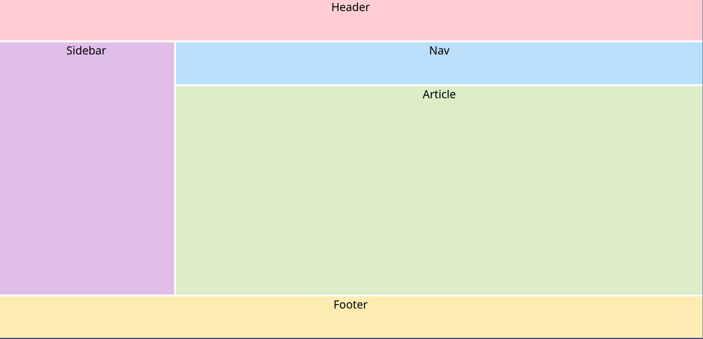
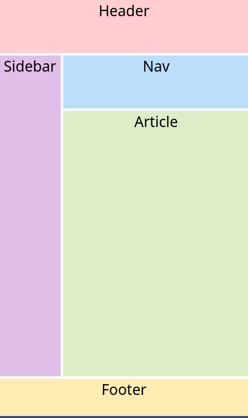

# Simple Responsive Layout

Use CSS Grid to build a simple responsive layout.

### Desired Outcome

- **Wide**

  

---

- **Narrow**

  

---

### Check List:

- The gap is `5px`.
- The grid has **two** columns.
- The grid has **four** rows.
- The grid tracks do not use static sizes **(no pixels!)**.
- The second column is _three times_ larger than the other.
- The third row is _five times_ larger than the others.
- The rows and columns stretch wider when making the browser window bigger.
- The rows and columns stretch taller when making the browser window smaller.
